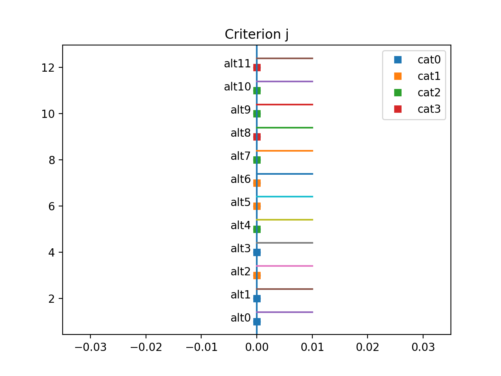

@page init_profiles Profile Initialization

# Profile Initialization Algorithm

## I Context

The theorical foundation of this part of the metaheuristic can be found in the thesis page 69-70. 

## II Profiles object

Before we get started explaining how the heuristic works lets talk about the objects that are used in this part of the algorithm.  

In MCDA, a "profile" is the performance values that delimits two categories.   
In the particular setting of 3 criteria and 2 categories, let the profile ```b0``` be the following vector  ```b0 = [0.1,0.2,0.3]```. Hence, ```b0``` models the separation of the category of rank ```0 ```(lowest) and the category of rank ```1``` (highest).  
If I were to have the alternatives ```a0 = [0,0.1,0.2]``` and ```a1 = [0.2,0.3,0.4]```, we can be certain that ```a0``` is assigned to the category of rank ```0``` and ```a1``` to the category of rank ```1``` independently from the value of lambda and the weights.

The ```Profiles``` object is therefore the agregations of several "profiles". The object is represented as a ```PerformanceTable``` object where there is a certain order constraint.
Similary as in the object ```PerformanceTable```, ```Profiles``` also has two different representations called modes (```"alt"``` or ```"crit"```). Each representation can be seen as a different way of seeing the object.

In both scenarios below, we have a MCDA problem with ```3``` categories and ```2``` criteria.

For instance, a ```Profiles``` object in ```"alt"``` mode can be visualised as below : 
```
 
  |           |crit0|  crit1|         |
  |-----------|-----|-------|---------|
  |           |     |       |         | category 0
  | b0        | 0.4 |   0.5 |         |
  |           |     |       |         | category 1 
  | b1        | 0.6 |   0.8 |         |
  |           |     |       |         | category 2 
 
 ```
 ```b0``` separates the categories of rank ```0``` and ```1``` and ```b1```  the ones of rank ```1``` and ```2```.

 On the contrary, a ```Profiles``` object in ```"crit"``` mode can be visualised as below : 

 ```
               b0            b1
  |            |             |               |
  |------------|-------------|---------------|
  |            |             |               |
  | crit0      |     0.4     |       0.6     |
  |            |             |               | 
  | crit1      |     0.5     |       0.8     |
  |            |             |               | 
  | category 0 |  category 1 |  category 2   |
 ```

Conceptually to pass from one mode to another, you can see it as a matrix transpose of the numerical values in the table.

An advised reader might have already intuited the ordered constraints of the ```Profiles``` object mentionned above.  

For the ```"alt"``` mode : 
 - For each criterion ```j``` and category `i` : ```b[i+1,j] >= b[i,j]```.  

For the ```"crit"``` mode (seen as a transpose matrix) : 
 - For each category limit ```i``` (ie column) and criterion ```j``` : ```cat_limit[i,j+1] >= cat_limit[i,j]```.

### Attributes

Same as a ```PerformanceTable``` object.

* mode : ```"alt"``` or ```"crit"```.
* sorted : set to ```1``` always since we have an ordered constraint.
* pt_ : a vector of a vector of ```Perf``` object meant to represent the problem.


### III Profile Initialization

The ```ProfileInitializer``` class computes a ```Profiles``` object with respect of a specific dataset.

### Attributes

* AlternativesPerformance - dataset of the global problem
* Config - Global config of the application

### Toy example

The following explanation is just an illustration of the thesis work. This example might help you understand better the heurisitc.

Let us suppose that we have a dataset of ```12``` alternative and only ```1``` criterion and ```4``` categories. Category rank ```0``` is considered as the worst and ```4``` the best. Visually, we can see the problem as such :


||
| :--:|
| *Toy Dataset* 


The first thing to do is to compute the category frequency. In our case, we see that for the category of rank ```0``` three alternatives belong to this category therefore the frequency is ```3/12=1/4```:   
- ```pi = [1/4,1/4,1/3,1/6]```  

Let be ```bi``` the profile that delimits the category ```i``` and ```i+1```.
In our example we therefore need to compute ```b0```, ```b1``` and ```b2```.

Computation of ```b0``` : 

As a reminder, ```b0``` separates the categories of rank ```0``` and ```1```. The potential candidates for ```b0``` are the performance values of the alternatives that are either classfied in either categories of rank ```0``` or ```1```.
Hence, the potential candidates here are : 
- ```alt0```, ```alt1```, ```alt2```, ```alt3```, ```alt5``` and ```alt6```.

Afterwards, let us suppose for each candidate we assign its performance value to the value of the profile ```b0```. The probability of each candidate performance value is proportional to its likelihood to classify correctly alternatives of the potential candidates based solely on the studied criterion. This probability is also weighted by the category frequency in order to take into account category inbalance. 

In other words, we set ```b0=alti``` for all ```alti``` candidates and see how well this value correctly classifies its other candidates and extract a certain probability from it.

Lets compute these probabilities.

- ```candidates = [alt0,alt1,alt2,alt3,alt5,alt6]```

For alternative ```alt0``` :   
This scenario can be visualised as the profile value being set to the value of the vertical purple bar right next to ```alt0```. If that were the case, then ```alt0```, ```alt2```, ```alt5``` and ```alt6``` are correctly classified and ```alt1``` and ```alt3``` aren't.
The probability is then : 
- ``` 1/freq0 + 0/freq0 + 1/freq1 + 0/freq0 + 1/freq1 + 1/freq1 = 1/freq0 + 3/freq1```  
where ```freqi``` is the frequency of the category of rank ```i```.

We do the same for alternative ```alt1```.  
The probability is :
- ``` 2/freq0 + 3/freq1```

For the candidate vector we have the following probabilities.  
 ```candidates = [alt0,alt1,alt2,alt3,alt5,alt6]```   
```proba = [1/freq0 + 3/freq1,  2/freq0 + 3/freq1, 3/freq0 + 2/freq1, 3/freq0 + 1/freq1, 3/freq0]```  
```proba = [16,20,20,16,12]```  
```proba_normalised = [0,19,0.24,0.24,0.19,0.14]```   
``` cum_sum_proba_normalised = [0.19,0.43,0.67,0.84,1]```

With the probabilities computed, we sample from a uniform distribution U(1) and according to its value we assign a certain alternative performance value to ```b0```. For example, it we sample ```0.3```, ```b0=alt1```.

This reasoning is done for each profile performance ```bi```.  
The same procedure is done for any criterion ```j``` and generalizes the problem of profile intialization.
