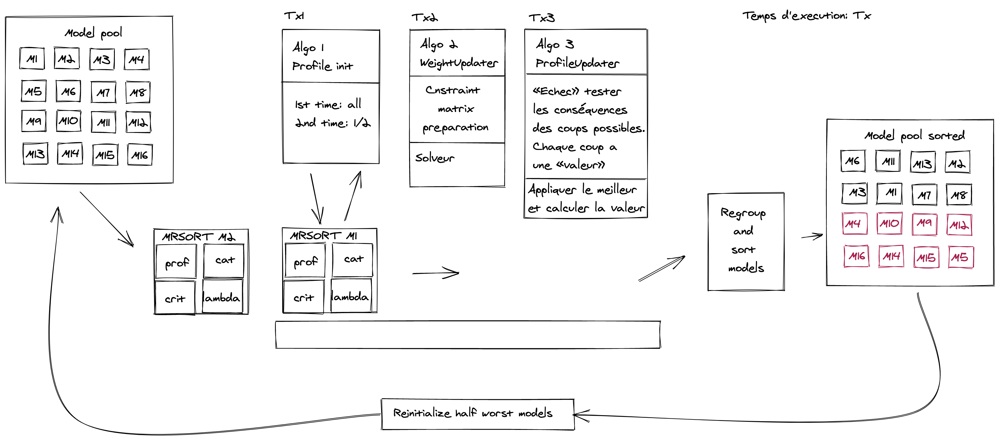

@page learning_algorithms Learning Algorithms

## Table

* @subpage init_profiles
* @subpage weight_updater
* @subpage update_profiles

We initiate a pool of models that will pass individually through the learning algorithms to improve their's efficiency using Sobrie's metaheuristic:

- ProfileInitializer initializes the profiles 
- WeightUpdater update the weights of the criteria
- ProfileUpdater update the profiles given the fixed weights

Then, we regroup the models, sort them by accuracy and reinitialize the last half of the models.

After n iteration or an accuracy of **70%??** for each model, the algorithm is stopped.

